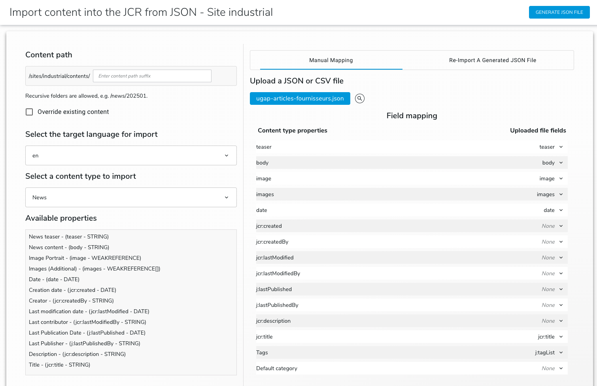
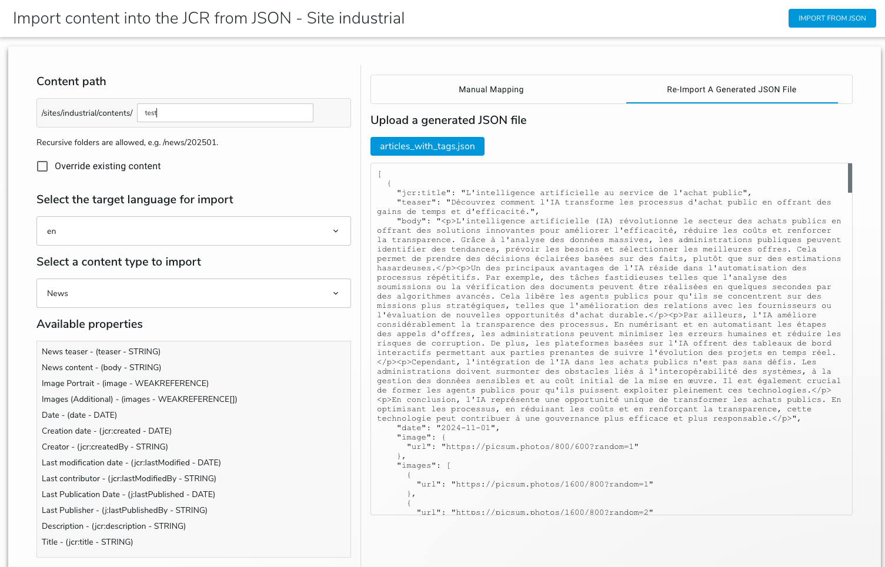
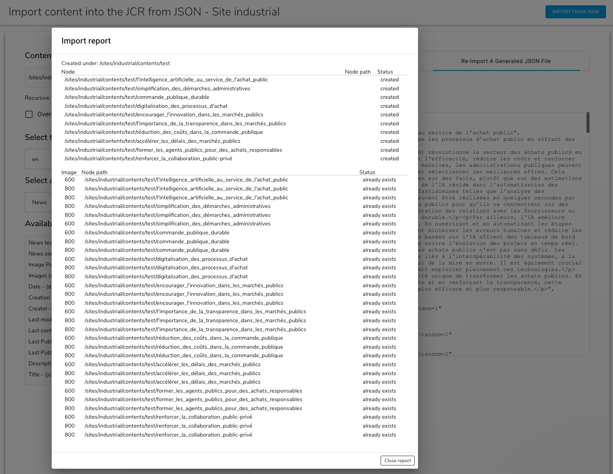

# ImportContentFromJson Module

The **ImportContentFromJson** module facilitates importing content into Jahia JCR (Java Content Repository) structure from a JSON file. It simplifies content creation by mapping JSON fields to JCR properties based on the selected content type.

***This is a Jahia V8+ module***

---

## Table of Contents

- [Features](#features)
- [Installation](#installation)
- [Usage](#usage)
- [Configuration](#configuration)
- [GraphQL Queries and Mutations](#graphql-queries-and-mutations)
- [Error Handling](#error-handling)
- [Customization](#customization)
- [License](#license)

---

## Features

- Import JSON **and CSV** files to a specified JCR content path. CSV parsing relies on [PapaParse](https://www.papaparse.com/).
- Manual mapping of uploaded json or csv with existing content type properties
- Support for both internationalized (i18n) and non-internationalized properties.
- Validation of JSON fields against the selected content type properties.
- Automatic folder creation if the specified path doesn’t exist.
- Skipping of existing nodes with detailed reporting of skipped items.
- Override Content if checked
- Fetch images from URL and upload them in to the JCR (using a proxy to avoid CORS issues)
- handle multiple for images and String Multiple
- check if image exists in JCR in folder importedFiles, before importing it
- A user-friendly interface with error messages and sample JSON previews.
- Tags will be created if present in json file
- Categories will be attached if matching existing system name
- Support unsplash API to create related images (need API Key)
- Create a Vanity URL automatically "/folder/title"
---

## Installation

1. Clone the repository:

    ```bash
    git clone https://github.com/smonier/ImportContentFromJson.git
    ```

2. Install dependencies:

    ```bash
    npm install or yarn   # ensures `papaparse` and other packages are installed
   ```

3. Build and deploy server:

    ```bash
   mvn clean install
   ```

### Running Tests

Ensure Node.js (version 18 or later recommended) is installed.

```bash
yarn test
```
or
```bash
npm test
```

---

## Usage

1. Access the module’s UI within the CMS interface (jContent -> Additional).
2. Follow these steps to import content:
    - **Select the base content path.**
    - **Choose a content type.**
    - **Upload a valid JSON or CSV file.**
    - **Map CSV columns to content properties using the Field Mapping interface.**
    - **Click “Import From JSON”** to initiate the process.
3. Ensure the data file follows the structure below and matches the names of the properties of the selected Content Type:

```json
       [
         {
            "jcr:title": "L'intelligence artificielle au service de l'achat public",
            "teaser": "Découvrez comment l'IA transforme les processus d'achat public en offrant des gains de temps et d'efficacité.",
            "body": "L'intelligence artificielle révolutionne les achats publics. Elle permet d'analyser des données massives pour prévoir les besoins et identifier les meilleures offres. L'automatisation libère du temps pour des tâches stratégiques, générant des économies significatives et une transparence accrue.",
            "date": "2024-11-01",
            "image": {
               "url": "https://img.freepik.com/photos-premium/banniere-nature-forestiere-ai-generative_73944-31146.jpg"
            },
            "images": [
               {
                  "url": "https://img.freepik.com/photos-premium/banniere-nature-forestiere-ai-generative_73944-31146.jpg"
               },
               {
                  "url": "https://st3.depositphotos.com/2189145/17529/i/450/depositphotos_175291112-stock-photo-hilly-field-beautiful-sky-hilly.jpg"
               }
            ]
         }
       ]
 ```

Multiple values declared for the property images (WeakReference)
```json
       [
         {
            ...,
            "images": [
               {
                  "url": "https://img.freepik.com/photos-premium/banniere-nature-forestiere-ai-generative_73944-31146.jpg"
               },
               {
                  "url": "https://st3.depositphotos.com/2189145/17529/i/450/depositphotos_175291112-stock-photo-hilly-field-beautiful-sky-hilly.jpg"
               }
            ],
            ...
         }
       ]
 ```

Multiple values declared for Tag property  
```json
       [
         {
            ...,
            "j:tagList": [
               "tag001",
               "tag002",
               "tag003"
            ],
            ...
         }
       ]
 ```

Multiple values declared for Category property (the category system name needs to exist to be attached)
```json
       [
         {
            ...,
            "j:defaultCategory": [
               "cat001",
               "cat002",
               "cat003"
            ],
            ...
         }
       ]
 ```
Unsplash image generation support
```json
       [
         {
            ...,
            "image": { 
               "url": "unsplash", 
               "query": "Dubai Marina grocery"
            },
            ...
         }
       ]
 ```

Example for sloc:store

Store Locator Module, available here : https://store.jahia.com/contents/modules-repository/org/jahia/se/modules/store-locator.html
```json
       [
   {
      "jcr:title": "Mexico City Mercado",
      "name": "Mexico City Mercado",
      "description": "Fusion flavors meet tradition at this flagship in La Roma.",
      "telephone": "+52-55-5555-6789",
      "url": "https://example.com/mexico-mercado",
      "image": { 
         "url": "unsplash", 
         "query": "Mexico City grocery"
      },
      "streetAddress": "Av. Álvaro Obregón 110",
      "addressLocality": "Mexico City",
      "addressRegion": "CDMX",
      "postalCode": "06700",
      "addressCountry": "MX",
      "latitude": 19.4178,
      "longitude": -99.1611,
      "openingHours": [
         "{\"dayOfWeek\": \"Monday\", \"opens\": \"10:00\", \"closes\": \"21:00\"}",
         "{\"dayOfWeek\": \"Sunday\", \"opens\": \"11:00\", \"closes\": \"19:00\"}"
      ],
      "priceRange": "$$",
      "amenityFeature": ["Delivery", "Tasting Area"],
      ":j:tagList": ["mexico", "roma", "urban", "flagship"],
      ":j:defaultCategory": ["store"]
   }
       ]
 ```
---
## Screenshots





Example of the Field Mapping interface showing JCR properties mapped to CSV columns.

```
| JCR Property | CSV Column |
|--------------|------------|
| jcr:title    | title      |
| body         | body       |
| image        | image      |
```
---

## Configuration

### Path Settings
- The base path is pre-set to `/sites/{siteKey}/contents`.
- Users can specify a subpath in the UI, but the base path remains immutable.

### Content Type
- Available content types and their properties are fetched via GraphQL.
- Only fields matching the content type properties are imported.

### Unsplash Access Key
- The module can fetch images from the Unsplash API when a JSON entry defines `"url": "unsplash"`.
- Configure the API key through the module properties using the `unsplash.accessKey` setting.

Create or edit the file `org.jahia.se.modules.importContentFromJson.cfg` under `META-INF/configurations`:

```properties
unsplash.accessKey=YOUR-UNSPLASH-ACCESS-KEY
```

Once set, the importer resolves Unsplash images based on the provided `query` field and stores them in the JCR.

Example JSON snippet:

```json
{
  "image": {
    "url": "unsplash",
    "query": "forest"
  }
}
```

### Image Proxy Servlet
- External images are downloaded through `/image-proxy/*` provided by `ImageProxyServlet.java`.
- This proxy endpoint avoids CORS issues when fetching images before they are uploaded.

---

## GraphQL Queries and Mutations

### Fetch Content Types
```graphql
query SiteContentTypesQuery($siteKey: String!, $language:String!) {
   jcr {
      nodeTypes(filter: {includeMixins: false, siteKey: $siteKey, includeTypes: ["jmix:droppableContent", "jnt:page", "jnt:file"], excludeTypes: ["jmix:studioOnly", "jmix:hiddenType", "jnt:editableFile"]}) {
         nodes {
            name
            displayName(language: $language)
            icon
         }
      }
   }
}
```

Example CSV file with corresponding columns:

```csv
title,teaser,body,date,image
"AI for public procurement","Short intro","Long text",2024-11-01,https://example.com/image.jpg
```

### Fetch Properties for Selected Content Type
```graphql
      query GetContentPropertiesQuery($type: String!, $language: String!) {
       jcr {
           nodeTypes(filter: {includeTypes: [$type]}) {
               nodes {
                  name
                  properties(fieldFilter: {filters: [{fieldName: "hidden", value: "false"}]}) {
                     name
                     hidden
                     displayName(language: $language)
                     internationalized
                     mandatory
                     requiredType
                     constraints
                     multiple
                  }
               }
            }
         }
      }   
```

### Create Content Folder
```graphql
mutation CreatePathMutation($path: String!, $name: String!) {
   jcr (workspace: EDIT){
      addNode(
         name: $name
         parentPathOrId: $path
         primaryNodeType: "jnt:contentFolder"
      ){
         uuid
         node {
            name
         }
      }
   }
}
```

### Create Content Node
```graphql
 mutation CreateContentMutation(
   $path: String!
   $name: String!
   $primaryNodeType: String!
   $properties: [InputJCRProperty]!
) {
   jcr(workspace: EDIT) {
      addNode(
         name: $name
         parentPathOrId: $path
         primaryNodeType: $primaryNodeType
         mixins: ["jmix:editorialContent"]
         properties: $properties
      ) {
         uuid
         node {
            name
            path
         }
      }
   }
```

---

## Error Handling

1. **Invalid JSON**
    - Displays an error message if the uploaded file is not a valid JSON.
2. **Path Issues**
    - Attempts to create the path if it doesn’t exist.
    - Reports errors if path creation fails.
3. **Existing Nodes**
    - Skips nodes that already exist and logs them in the error report.
4. **Property Validation**
    - Ignores fields in the JSON that don’t match the selected content type properties.

---

## Customization

- **Field Mapping**: Extend or modify the `processJsonData` function to handle additional JSON fields.
- **Styles**: Update `ImportContent.component.scss` to customize the UI design.
- **Localization**: Add translations for new languages in the resource bundle files.

---

## License

This project is licensed under the MIT License. See the [LICENSE](LICENSE) file for details.

---

## Additional Notes

- Ensure the JSON file adheres to the structure required by the selected content type.
- CSV files must include a header row. Only comma-separated values are supported.
- Use the sample JSON preview to verify file content before importing.
- For advanced configurations, consult the module documentation or support team.


