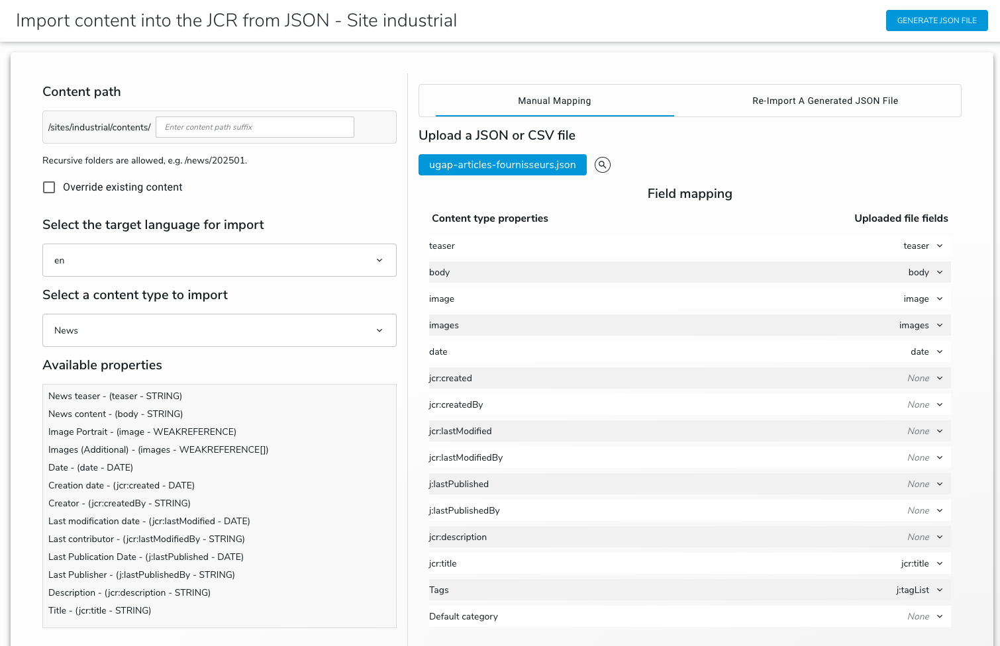
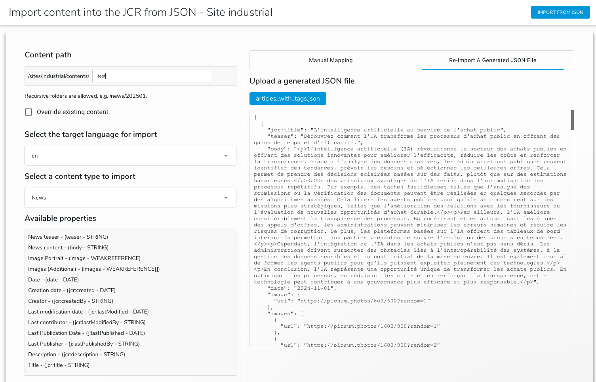
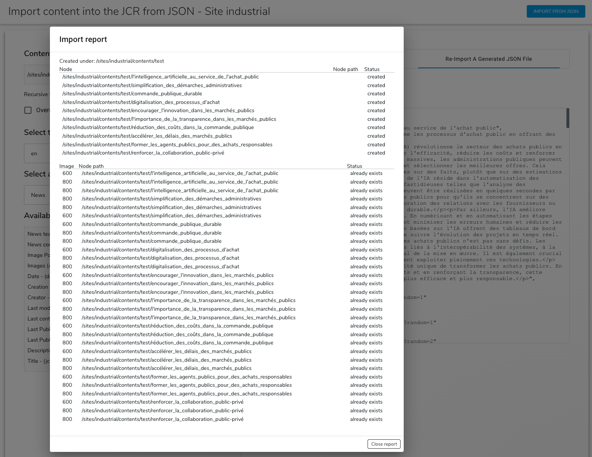

# ImportContentFromJson Module

The **ImportContentFromJson** module facilitates importing content into Jahia JCR (Java Content Repository) structure from a JSON file. It simplifies content creation by mapping JSON fields to JCR properties based on the selected content type.

***This is a Jahia V8+ module***

---

## Table of Contents

- [Features](#features)
- [Production Readiness & Security](#production-readiness--security)
- [Installation](#installation)
- [Usage](#usage)
- [Configuration](#configuration)
- [GraphQL Queries and Mutations](#graphql-queries-and-mutations)
- [Error Handling](#error-handling)
- [Customization](#customization)
- [Changelog](#changelog)
- [License](#license)

---

## Features

- Import JSON **and CSV** files to a specified JCR content path. CSV parsing relies on [PapaParse](https://www.papaparse.com/).
- Manual mapping of uploaded json or csv with existing content type properties (jmix:mainResource only)
- Support for both internationalized (i18n) and non-internationalized properties.
- Validation of JSON fields against the selected content type properties.
- Automatic folder creation if the specified path doesn’t exist.
- Skipping of existing nodes with detailed reporting of skipped items.
- Override Content if checked
- Fetch images from URL and upload them in to the JCR (using a proxy to avoid CORS issues)
- handle multiple for images and String Multiple
- check if image exists in JCR in folder importedFiles, before importing it
- A user-friendly interface with error messages and sample JSON previews.
- Tags will be created if present in json file
- Categories will be attached if matching existing system name
- Support unsplash API to create related images (need API Key)
- Create a Vanity URL automatically "/folder/title"

---

## Production Readiness & Security

This module implements enterprise-grade security and performance features suitable for production environments:

### Security Features

- **Input Validation & Sanitization**
  - File size limits (default: 10MB max) to prevent DoS attacks
  - File type validation (JSON/CSV only)
  - Path traversal protection preventing "../" attacks
  - JCR node name sanitization (removes special characters, limits length to 32 chars)
  - XSS prevention through URL validation and string sanitization
  - JSON structure validation with size limits (max 1000 items)

- **Secure Logging**
  - Environment-aware logging (verbose in development, minimal in production)
  - Automatic sanitization of sensitive data in logs
  - Structured error messages without exposing internal details
  - No credentials or tokens logged

- **URL & Image Security**
  - Whitelist-based protocol validation (https:// only for external images)
  - Image URL validation before fetching
  - Proxy servlet for CORS-safe image downloads
  - Prevention of SSRF attacks through URL sanitization

### Performance Optimizations

- **Batch Processing**
  - Configurable batch size (default: 50 items per batch)
  - Memory-efficient processing for large imports
  - Automatic memory availability checks

- **Rate Limiting**
  - API call throttling (100ms delay between calls)
  - Prevents overwhelming the JCR repository
  - Configurable through constants

- **Concurrent Operations**
  - Parallel processing for independent operations
  - Retry logic with exponential backoff (max 3 retries)
  - Error isolation to prevent cascade failures

- **Resource Management**
  - Debounced user inputs to reduce unnecessary processing
  - Performance monitoring and measurement utilities
  - Garbage collection hints for large imports

### Configuration Constants

All security and performance parameters are centralized in `ImportContent.constants.js`:

```javascript
// File size limits
MAX_FILE_SIZE: 10 * 1024 * 1024  // 10MB

// Import limits
MAX_ITEMS_PER_IMPORT: 1000       // Maximum items per import
BATCH_SIZE: 50                    // Items per batch

// Rate limiting
API_CALL_DELAY: 100              // Milliseconds between API calls
MAX_RETRIES: 3                   // Maximum retry attempts
RETRY_DELAY: 1000                // Initial retry delay (ms)
```

### Best Practices for Production

1. **Before Deployment**
   - Set `NODE_ENV=production` to enable production logging mode
   - Review and adjust MAX_FILE_SIZE based on server capacity
   - Configure appropriate BATCH_SIZE for your JCR repository
   - Test with realistic data volumes

2. **Monitoring**
   - Monitor server logs for errors and warnings
   - Track import performance metrics
   - Watch for memory usage during large imports

3. **User Permissions**
   - Ensure users have appropriate JCR permissions for target paths
   - Restrict access to sensitive content paths
   - Review Jahia security roles and ACLs

---

## Installation

1. Clone the repository:

    ```bash
    git clone https://github.com/smonier/ImportContentFromJson.git
    ```

2. Install dependencies:

    ```bash
    npm install or yarn   # ensures `papaparse` and other packages are installed
   ```

3. Build and deploy server:

    ```bash
   mvn clean install
   ```

### Running Tests

Ensure Node.js (version 18 or later recommended) is installed.

```bash
yarn test
```
or
```bash
npm test
```

---

## Usage

1. Access the module’s UI within the CMS interface (jContent -> Content Tools).
2. Follow these steps to import content:
    - **Select the base content path.**
    - **Choose a content type.**
    - **Upload a valid JSON or CSV file.**
    - **Map CSV columns to content properties using the Field Mapping interface.**
    - **Click “Import From JSON”** to initiate the process.
3. Ensure the data file follows the structure below and matches the names of the properties of the selected Content Type:

**Standard JSON import with remote images:**
```json
       [
         {
            "jcr:title": "L'intelligence artificielle au service de l'achat public",
            "teaser": "Découvrez comment l'IA transforme les processus d'achat public en offrant des gains de temps et d'efficacité.",
            "body": "L'intelligence artificielle révolutionne les achats publics. Elle permet d'analyser des données massives pour prévoir les besoins et identifier les meilleures offres. L'automatisation libère du temps pour des tâches stratégiques, générant des économies significatives et une transparence accrue.",
            "date": "2024-11-01",
            "image": {
               "url": "https://img.freepik.com/photos-premium/banniere-nature-forestiere-ai-generative_73944-31146.jpg"
            },
            "images": [
               {
                  "url": "https://img.freepik.com/photos-premium/banniere-nature-forestiere-ai-generative_73944-31146.jpg"
               },
               {
                  "url": "https://st3.depositphotos.com/2189145/17529/i/450/depositphotos_175291112-stock-photo-hilly-field-beautiful-sky-hilly.jpg"
               }
            ]
         }
       ]
 ```

**Import with local server file paths:**
```json
       [
         {
            "jcr:title": "Product with Local Images",
            "teaser": "Using images from server filesystem",
            "image": {
               "url": "file:///var/jahia/import-assets/products/main-product.jpg"
            },
            "images": [
               {
                  "url": "file:///var/jahia/import-assets/products/gallery/view1.jpg"
               },
               {
                  "url": "file:///var/jahia/import-assets/products/gallery/view2.jpg"
               }
            ]
         }
       ]
 ```

**Mixed import (remote + local + Unsplash):**
```json
       [
         {
            "jcr:title": "Mixed Image Sources Example",
            "image": {
               "url": "unsplash",
               "query": "Dubai Marina"
            },
            "images": [
               {
                  "url": "https://example.com/remote-image.jpg"
               },
               {
                  "url": "file:///var/jahia/assets/local-image.jpg"
               }
            ]
         }
       ]
 ```
               {
                  "url": "https://st3.depositphotos.com/2189145/17529/i/450/depositphotos_175291112-stock-photo-hilly-field-beautiful-sky-hilly.jpg"
               }
            ]
         }
       ]
 ```

Multiple values declared for the property images (WeakReference)
```json
       [
         {
            ...,
            "images": [
               {
                  "url": "https://img.freepik.com/photos-premium/banniere-nature-forestiere-ai-generative_73944-31146.jpg"
               },
               {
                  "url": "https://st3.depositphotos.com/2189145/17529/i/450/depositphotos_175291112-stock-photo-hilly-field-beautiful-sky-hilly.jpg"
               }
            ],
            ...
         }
       ]
 ```

**Import images from local server file paths** (using `file://` protocol)
```json
       [
         {
            ...,
            "image": {
               "url": "file:///var/jahia/import-assets/product-image.jpg"
            },
            "images": [
               {
                  "url": "file:///var/jahia/import-assets/gallery/image1.jpg"
               },
               {
                  "url": "file:///var/jahia/import-assets/gallery/image2.jpg"
               }
            ],
            ...
         }
       ]
 ```
> **Note:** Local file paths must be accessible from the Jahia server. The module will read files directly from the server's filesystem. Ensure proper file permissions and security restrictions are in place.

Multiple values declared for Tag property  
```json
       [
         {
            ...,
            "j:tagList": [
               "tag001",
               "tag002",
               "tag003"
            ],
            ...
         }
       ]
 ```

Multiple values declared for Category property (the category system name needs to exist to be attached)
```json
       [
         {
            ...,
            "j:defaultCategory": [
               "cat001",
               "cat002",
               "cat003"
            ],
            ...
         }
       ]
 ```
Unsplash image generation support
```json
       [
         {
            ...,
            "image": { 
               "url": "unsplash", 
               "query": "Dubai Marina grocery"
            },
            ...
         }
       ]
 ```

Example for sloc:store

Store Locator Module, available here : https://store.jahia.com/contents/modules-repository/org/jahia/se/modules/store-locator.html
```json
       [
   {
      "jcr:title": "Mexico City Mercado",
      "name": "Mexico City Mercado",
      "description": "Fusion flavors meet tradition at this flagship in La Roma.",
      "telephone": "+52-55-5555-6789",
      "url": "https://example.com/mexico-mercado",
      "image": { 
         "url": "unsplash", 
         "query": "Mexico City grocery"
      },
      "streetAddress": "Av. Álvaro Obregón 110",
      "addressLocality": "Mexico City",
      "addressRegion": "CDMX",
      "postalCode": "06700",
      "addressCountry": "MX",
      "latitude": 19.4178,
      "longitude": -99.1611,
      "openingHours": [
         "{\"dayOfWeek\": \"Monday\", \"opens\": \"10:00\", \"closes\": \"21:00\"}",
         "{\"dayOfWeek\": \"Sunday\", \"opens\": \"11:00\", \"closes\": \"19:00\"}"
      ],
      "priceRange": "$$",
      "amenityFeature": ["Delivery", "Tasting Area"],
      ":j:tagList": ["mexico", "roma", "urban", "flagship"],
      ":j:defaultCategory": ["store"]
   }
       ]
 ```
---
## Screenshots





Example of the Field Mapping interface showing JCR properties mapped to CSV columns.

```
| JCR Property | CSV Column |
|--------------|------------|
| jcr:title    | title      |
| body         | body       |
| image        | image      |
```
---

## Configuration

### Path Settings
- The base path is pre-set to `/sites/{siteKey}/contents`.
- Users can specify a subpath in the UI, but the base path remains immutable.

### Content Type
- Available content types and their properties are fetched via GraphQL.
- Only fields matching the content type properties are imported.

### Unsplash Access Key
- The module can fetch images from the Unsplash API when a JSON entry defines `"url": "unsplash"`.
- Configure the API key through the module properties using the `unsplash.accessKey` setting.

Create or edit the file `org.jahia.se.modules.importContentFromJson.cfg` under `META-INF/configurations`:

```properties
unsplash.accessKey=YOUR-UNSPLASH-ACCESS-KEY
```

Once set, the importer resolves Unsplash images based on the provided `query` field and stores them in the JCR.

Example JSON snippet:

```json
{
  "image": {
    "url": "unsplash",
    "query": "forest"
  }
}
```

### Image Proxy Servlet
- External images are downloaded through `/image-proxy/*` provided by `ImageProxyServlet.java`.
- This proxy endpoint avoids CORS issues when fetching images before they are uploaded.

### Local File Proxy Servlet
- Local server files can be imported using the `file://` protocol through `/local-file-proxy/*` provided by `LocalFileProxyServlet.java`.
- This allows importing images and files directly from the server's filesystem without external downloads.
- **Security:** Path traversal protection is enforced to prevent unauthorized file access.
- Example: `"url": "file:///var/jahia/import-assets/product.jpg"`

---

## GraphQL Queries and Mutations

### Fetch Content Types
```graphql
query SiteContentTypesQuery($siteKey: String!, $language:String!) {
   jcr {
      nodeTypes(filter: {includeMixins: false, siteKey: $siteKey, includeTypes: ["jmix:droppableContent", "jnt:page", "jnt:file"], excludeTypes: ["jmix:studioOnly", "jmix:hiddenType", "jnt:editableFile"]}) {
         nodes {
            name
            displayName(language: $language)
            icon
         }
      }
   }
}
```

Example CSV file with corresponding columns:

```csv
title,teaser,body,date,image
"AI for public procurement","Short intro","Long text",2024-11-01,https://example.com/image.jpg
```

### Fetch Properties for Selected Content Type
```graphql
      query GetContentPropertiesQuery($type: String!, $language: String!) {
       jcr {
           nodeTypes(filter: {includeTypes: [$type]}) {
               nodes {
                  name
                  properties(fieldFilter: {filters: [{fieldName: "hidden", value: "false"}]}) {
                     name
                     hidden
                     displayName(language: $language)
                     internationalized
                     mandatory
                     requiredType
                     constraints
                     multiple
                  }
               }
            }
         }
      }   
```

### Create Content Folder
```graphql
mutation CreatePathMutation($path: String!, $name: String!) {
   jcr (workspace: EDIT){
      addNode(
         name: $name
         parentPathOrId: $path
         primaryNodeType: "jnt:contentFolder"
      ){
         uuid
         node {
            name
         }
      }
   }
}
```

### Create Content Node
```graphql
 mutation CreateContentMutation(
   $path: String!
   $name: String!
   $primaryNodeType: String!
   $properties: [InputJCRProperty]!
) {
   jcr(workspace: EDIT) {
      addNode(
         name: $name
         parentPathOrId: $path
         primaryNodeType: $primaryNodeType
         mixins: ["jmix:editorialContent"]
         properties: $properties
      ) {
         uuid
         node {
            name
            path
         }
      }
   }
```

---

## Error Handling

1. **Invalid JSON**
    - Displays an error message if the uploaded file is not a valid JSON.
2. **Path Issues**
    - Attempts to create the path if it doesn’t exist.
    - Reports errors if path creation fails.
3. **Existing Nodes**
    - Skips nodes that already exist and logs them in the error report.
4. **Property Validation**
    - Ignores fields in the JSON that don’t match the selected content type properties.

---

## Customization

- **Field Mapping**: Extend or modify the `processJsonData` function to handle additional JSON fields.
- **Styles**: Update `ImportContent.component.scss` to customize the UI design.
- **Localization**: Add translations for new languages in the resource bundle files.

---

## Changelog

### Version 1.1.5-SNAPSHOT

#### New Features 🎉
- **Local File Import Support**: Import images from server filesystem using `file://` protocol
  - New `LocalFileProxyServlet.java` handles local file access
  - Automatic detection of `file://` URLs in image properties
  - Works with both single and multiple image imports
  - Path traversal protection for security
  - Example: `"url": "file:///var/jahia/import-assets/image.jpg"`

#### UI Modernization 🎨
- **Moonstone Component Migration**: Replaced Material-UI components with custom Moonstone-styled components
  - New custom Modal component (`Modal.jsx`) replacing MUI Dialog
  - New custom Tabs component (`Tabs.jsx`) replacing MUI Tabs
  - New custom Checkbox component (`Checkbox.jsx`) replacing MUI FormControlLabel
  - Reduced bundle size and improved performance

- **Font Size Reduction**: More compact and professional UI
  - Base font reduced from 16px to 14px (0.875rem)
  - Headings, subheadings, and captions proportionally reduced
  - Improved information density while maintaining readability

- **Layout Improvements**
  - Reduced padding and margins throughout
  - Better visual hierarchy with adjusted spacing
  - Cleaner, modern design consistent with Jahia Moonstone

### Version 1.1.4

#### Security Enhancements 🔒
- **Input Validation System**: Comprehensive validation module (`ImportContent.validation.js`)
  - File size validation (10MB limit) to prevent denial-of-service attacks
  - File type whitelisting (JSON/CSV only)
  - Path traversal protection preventing "../" directory manipulation
  - JCR node name sanitization (removes invalid characters, enforces 32-char limit)
  - URL validation with protocol whitelisting (https:// only for external resources)
  - Array size limits to prevent memory exhaustion (max 1000 items)
  - JSON structure validation with depth checking

- **Secure Logging**: Production-ready logging system (`ImportContent.logger.js`)
  - Environment-aware logging (verbose in dev, minimal in production)
  - Automatic sanitization of sensitive data (passwords, tokens, API keys)
  - Structured error messages without internal detail exposure
  - Replaces all console.log/error/warn calls

- **XSS Prevention**: String sanitization for user inputs
  - HTML entity encoding for display values
  - Script tag removal from user content
  - Safe URL construction

#### Performance Optimizations ⚡
- **Performance Utilities Module** (`ImportContent.performance.js`)
  - Batch processing for large imports (configurable batch size: 50)
  - Concurrent operation support with Promise.allSettled
  - Rate limiting to prevent API overload (100ms between calls)
  - Retry logic with exponential backoff (max 3 attempts)
  - Memory availability checks before large operations
  - Debounce/throttle utilities for UI interactions
  - Performance measurement helpers

- **Resource Management**
  - Automatic garbage collection hints after large imports
  - Memory-efficient streaming for large file processing
  - Configurable limits for batch sizes and concurrent operations

#### Configuration & Constants
- **Centralized Configuration** (`ImportContent.constants.js`)
  - All limits, timeouts, and validation rules in one place
  - Runtime environment detection
  - Configurable error messages
  - File type and size constraints
  - API rate limiting parameters
  - Batch processing configuration

#### Features
- **Extended Properties Support**: Added support for displaying and mapping properties from mixin types (`extendedBy`)
  - GraphQL query now retrieves properties from all mixin types associated with the selected content type
  - Properties are automatically extracted from mixins like `jmix:tagged`, `jmix:seoHtmlHead`, `jmix:categorized`, etc.

#### UI Enhancements
- **Properties List**: Enhanced property display with visual separation
  - Main properties are shown in a dedicated section
  - Mixin properties are grouped by their mixin type with clear headers
  - Each mixin group displays the mixin's display name and technical name

- **Field Mapping Panel**: Improved field mapping interface
  - Organized sections for Main Properties, Mixin Properties, and Extra Fields
  - Visual section headers with distinct styling for better readability
  - Consistent alignment across all property sections
  - Properties from mixins are now fully available for mapping

- **Enhanced Error Reporting**
  - Detailed validation errors with context
  - User-friendly error messages
  - Secure error logging without sensitive data

#### Localization
- Added new translation keys in all supported languages (EN, FR, DE, ES):
  - `mainProperties`: Labels for main content type properties
  - `mixinProperties`: Labels for mixin-specific properties
  - `extraFields`: Labels for additional fields like tags and categories

#### Technical Improvements
- Enhanced properties extraction logic to merge main properties with mixin properties
- Added metadata tracking (`mixinName`, `mixinDisplayName`) for property grouping
- Improved SCSS styling with new classes for section headers and property groups
- **Automatic Mixin Management**: Mixins are now automatically added to nodes before setting properties
  - When creating content, all required mixins are determined from the properties being set
  - When updating content, missing mixins are automatically added before property updates
  - Ensures JCR compliance by adding mixins before their properties are set
  - Updated GraphQL mutations to accept dynamic mixin arrays
- **Code Quality**: All ESLint errors resolved, production-ready codebase
- **Production Build**: Verified successful Maven build with webpack optimization

---

## License

This project is licensed under the MIT License. See the [LICENSE](LICENSE) file for details.

---

## Additional Notes

- Ensure the JSON file adheres to the structure required by the selected content type.
- CSV files must include a header row. Only comma-separated values are supported.
- Use the sample JSON preview to verify file content before importing.
- For advanced configurations, consult the module documentation or support team.


